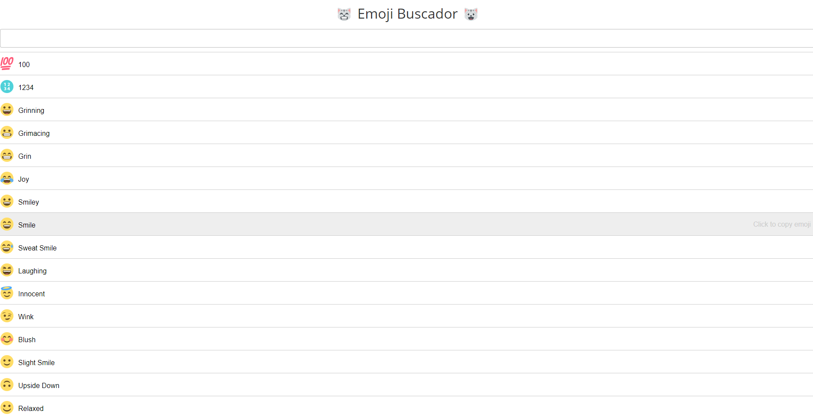

# React Buscador de Emoji

Buscador de emoji




## Intalação

```sh
$ git clone https://github.com/ldonizete/react-emoji-buscador.git
$ cd react-emoji-buscador
$ NPM install
$ NPM start
```

## Licença

[MIT](http://opensource.org/licenses/MIT)

Copyright (c) Lucas Donizete 2020